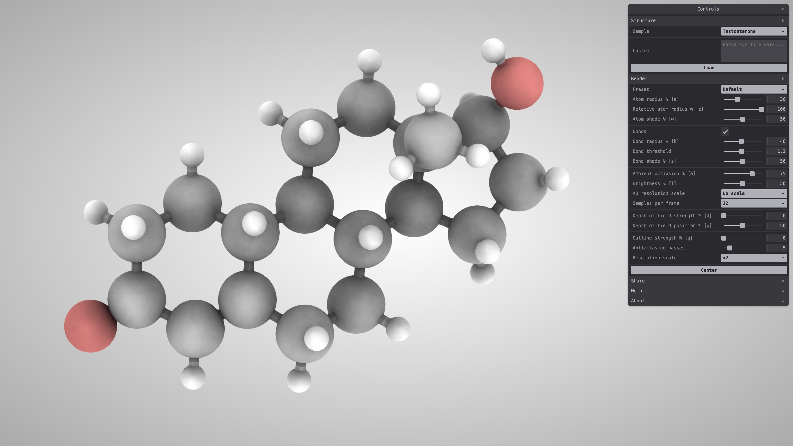

   

[Live version](https://vangelov.github.io/modern-speck/)

## Modern Speck

This project is a modernized reimplementation of the [original Speck molecule renderer](https://github.com/wwwtyro/speck) created by Rye Terrell.

### Notable changes:

- Full-viewport rendering
- Single draw for color and normal outputs using MRT
- Instanced rendering for atoms and bonds
- Ping-pong rendering for AO and FXAA instead of texture copying
- Structured the renderer around modular rendering passes
- Rewritten in TypeScript, built with [Vite](https://vite.dev/)
- Upgraded to WebGL 2 using [PicoGL.js](https://tsherif.github.io/picogl.js/)
- New UI built with [Tweakpane](https://tweakpane.github.io/docs/)

## Scripts

In the project directory, you can run:

#### `npm run dev`

Runs the app in the development mode.\
Open [http://127.0.0.1:5173/](http://127.0.0.1:5173/) to view it in the browser.

#### `npm run build`

Builds the app for production in the `dist` folder.
